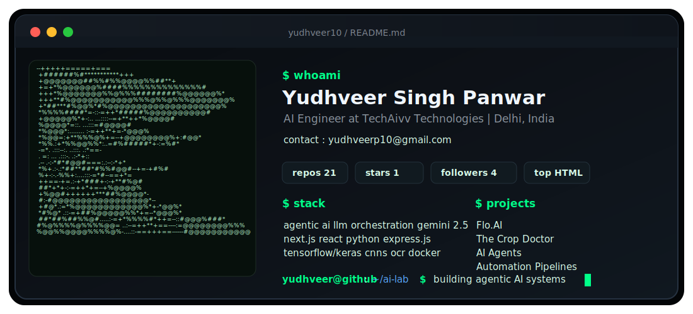

<div align="center">


[](https://git.io/typing-svg)

</div>

<br>

<div align="center">
  
</div>

<br>

## About Me

```bash
> whoami

Name      : Yudhveer Singh Panwar
Username  : yudhveer10
Role      : AI Engineer
Company   : TechAIVV
Location  : Delhi, India
Focus     : AI agents, LLM apps, automation, full-stack AI products
Email     : yudhveerp10@gmail.com
```

I build AI-first products with a practical engineering mindset: fast backends, clean frontends, agentic workflows, and systems that move from prototype to production.

## Tech Arsenal

<div align="center">

### Languages


### Frontend


### Backend


### Databases


### AI / ML


</div>

## Current Builds

| Project | What it is |
| --- | --- |
| HireAIVV | AI-powered recruitment and hiring intelligence platform |
| AI Content Repurposing Platform | Converts long-form content into multi-platform assets |
| LangGraph Workflows | Agentic workflows with stateful AI orchestration |
| AI Agents | Task-focused autonomous systems and tool-using assistants |
| Panwar Alpha | TradingView indicator and market analysis experiments |

## GitHub Analytics

<div align="center">


<br><br>


</div>

## Contribution Graph

<div align="center">
  
</div>

## Contribution Snake

<div align="center">
  
</div>

## Trophies

<div align="center">
  
</div>

## Connect

<div align="center">

[](https://linkedin.com/in/yudhveer-singh-panwar-504339265/)
[](mailto:yudhveerp10@gmail.com)
[](https://leetcode.com/u/yudhveerpanwar/)

</div>

<br>

<div align="center">
  
</div>
