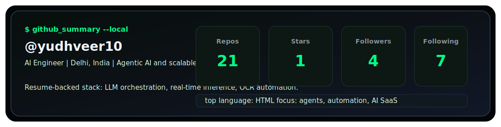

<div align="center">


[](https://git.io/typing-svg)

</div>

<br>

<div align="center">
  
</div>

<br>

## About Me

```bash
> whoami

Name      : Yudhveer Singh Panwar
Username  : yudhveer10
Role      : AI Engineer
Company   : TechAivv Technologies
Location  : Delhi, India
Focus     : Agentic AI, LLM orchestration, real-time inference, AI SaaS
Email     : yudhveerp10@gmail.com
```

I build AI-powered products across the full stack, connecting machine learning systems with fast, user-facing applications. My work spans agentic workflow generation, scalable AI SaaS platforms, backend automation, OCR pipelines, and deep learning diagnostics.

## Tech Arsenal

<div align="center">

### Languages


### Frontend


### Backend


### Databases


### AI / ML / Automation


### Cloud / DevOps


</div>

## Current Builds

| Project | What it is |
| --- | --- |
| Flo.AI | Agentic AI framework using Gemini 2.5 for 15+ step workflow automation |
| The Crop Doctor | CNN-based crop disease diagnostics trained on 5,000+ annotated images |
| AI Automation Pipelines | Python, Pandas, NumPy, OCR, scheduling, and API integration workflows |
| Real-time AI SaaS | Full-stack AI platform work with responsive UI and low-latency inference |

## GitHub Analytics

<div align="center">



<br><br>


</div>

## Contribution Graph

<div align="center">
  
</div>

## Contribution Snake

<div align="center">
  
</div>

## Highlights

| Area | Signal |
| --- | --- |
| Agentic AI | Gemini 2.5, LLM orchestration, generative workflow automation |
| Full Stack AI | Next.js, React, Python, Express.js, real-time AI inference |
| Automation | Pandas, NumPy, OCR, backend scheduling, API integrations |
| Deep Learning | TensorFlow/Keras, CNNs, image classification, web integration |
| Cloud & Delivery | AWS, Docker, Kubernetes, CI/CD |

## Connect

<div align="center">

[](https://linkedin.com/in/yudhveer-singh-panwar-504339265/)
[](mailto:yudhveerp10@gmail.com)
[](https://leetcode.com/u/yudhveerpanwar/)

</div>

<br>

<div align="center">
  
</div>
